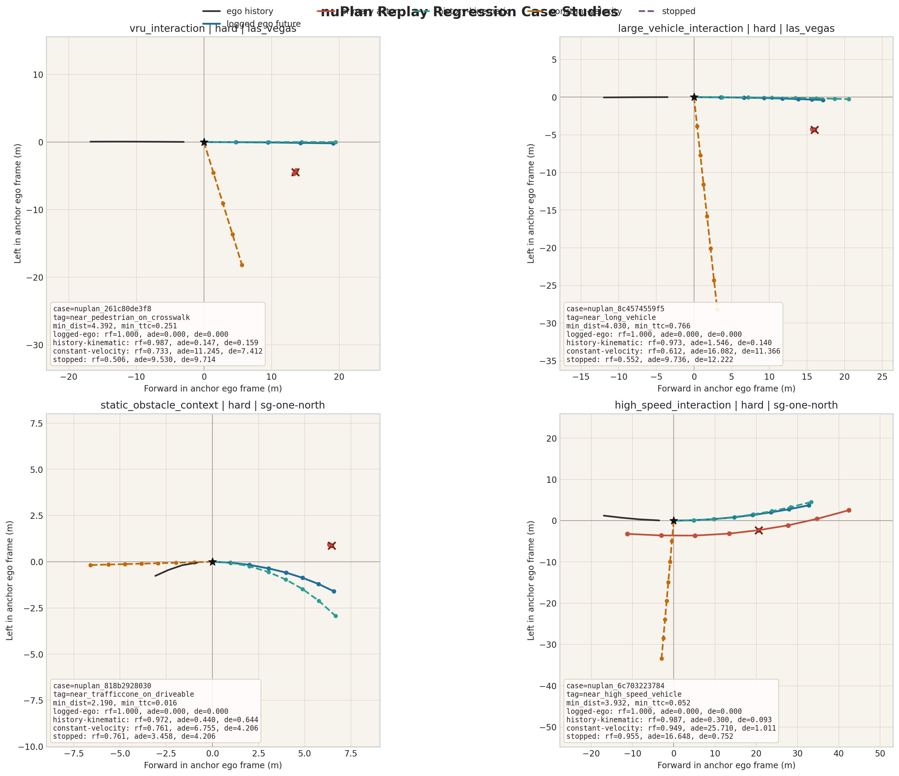
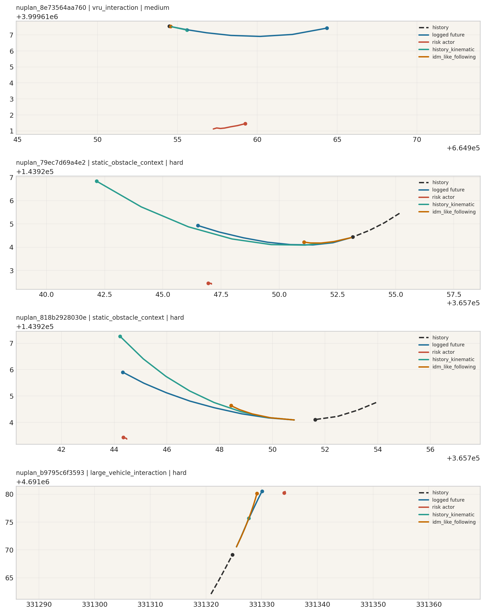
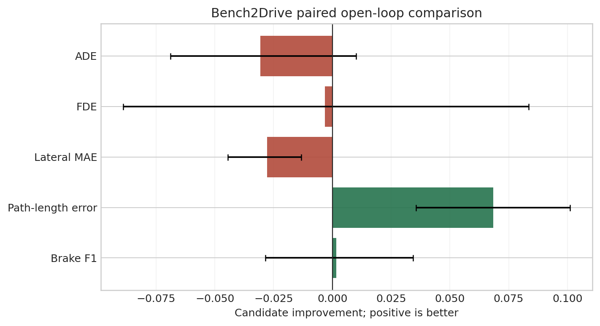
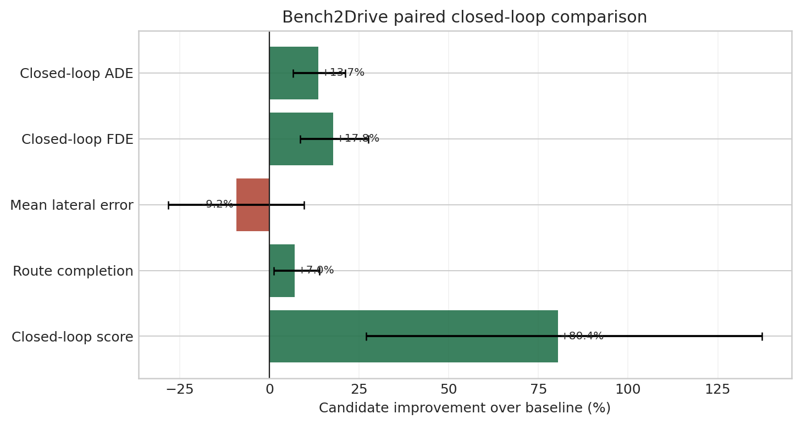

<div align="center">

# Autonomous Driving Risk Scenario Benchmark Agent

Scenario-centric risk mining, benchmark generation, replay evaluation, and vision E2E planner validation across `nuScenes`, `nuPlan`, `Bench2Drive`, and `CARLA`.

`Python 3.10+` `Conda` `nuScenes` `nuPlan` `CARLA` `Bench2Drive` `Ollama` `Benchmarking`

[English](README.md) | [简体中文](README.zh-CN.md)

</div>

<p align="center">
  <video src="https://github.com/user-attachments/assets/73f1467c-1bce-4f4a-b5b6-22fafa78e848" controls muted playsinline width="100%"></video>
</p>

## Paired Model Comparison

The primary model comparison evaluates `dynamics_regularized_half` against `trajectory_baseline` on the same `64` held-out model-in-the-loop cases. Positive values denote improvement; intervals are paired case-level percentile-bootstrap intervals (`10,000` replicates, seed `7`).

| Metric | Baseline | Candidate | Improvement | 95% CI |
| --- | ---: | ---: | ---: | ---: |
| Closed-loop ADE | 11.260 m | 9.721 m | `+1.539 m` | `[+0.739, +2.382]` |
| Closed-loop FDE | 23.690 m | 19.471 m | `+4.218 m` | `[+2.051, +6.541]` |
| Route completion | 0.746 | 0.799 | `+0.053` | `[+0.009, +0.105]` |
| Closed-loop score | 0.087 | 0.157 | `+0.070` | `[+0.023, +0.120]` |
| Mean lateral error | 1.436 m | 1.568 m | `-0.132 m` | `[-0.406, +0.140]` |

The candidate improves rollout progress and accumulated trajectory error, while the lateral-error change is inconclusive. On the paired held-out open-loop split (`4,334` samples, `97` clips), path-length error improves by `0.069 m` (`95% CI [+0.036, +0.101]`), while lateral MAE increases by `0.028 m` (`95% CI [-0.045, -0.013]`); ADE, FDE, and brake F1 are inconclusive. This trade-off is the main model result.

`Autonomous Driving Risk Scenario Benchmark Agent` uses a shared risk-scenario taxonomy. `nuScenes` mines and validates real-world scenario anchors, `nuPlan` evaluates logged replay and replay-based closed-loop behavior, `Bench2Drive` trains and diagnoses a vision E2E trajectory planner, and `CARLA` provides closed-loop visual evidence for semantically matched scenarios that pass predefined audit criteria.

## Scenario-Centric Design

The taxonomy in [configs/scenario_taxonomy.yaml](configs/scenario_taxonomy.yaml) defines the bridge between data mining and model evaluation.

| Backend | Role |
| --- | --- |
| `nuScenes` | Mine risk anchors from real-world logs and export retrieval, perception, BEV occupancy, and world-model slices. |
| `nuPlan` | Replay logged ego behavior and evaluate accumulated closed-loop error under the same scenario families. |
| `Bench2Drive` | Train and evaluate a multi-camera vision E2E trajectory planner on simulator driving data. |
| `CARLA` | Run visual closed-loop rollouts for selected scenario targets and apply semantic audit criteria. |

<p align="center">
  
</p>

## Vision E2E Planner Training

The Bench2Drive component trains a vision E2E trajectory planner from six RGB cameras and route features. The model predicts multimodal future ego waypoints together with control and brake heads, using transformer pooling over camera, route, and trajectory-mode tokens. The trained checkpoint is evaluated by supervised validation, a simplified model-in-the-loop rollout, and selected CARLA semantic rollouts.

| Item | Value |
| --- | --- |
| Input | six RGB camera views and route features |
| Model | `research` trajectory transformer with `4` trajectory modes |
| Training set | `35,629` train, `4,977` validation, and `4,334` held-out test samples |
| Training runtime | `8`-GPU DDP, `24` epochs, `289.538s` |
| Candidate on held-out test set | ADE `1.653`, FDE `2.697`, lateral MAE `0.552 m`, brake F1 `0.828` |
| Closed-loop diagnostic | `64` held-out test cases; route completion `0.799`; closed-loop score `0.157` |
| CARLA evidence | one audited closed-loop demo with `0` collisions and safety override ratio `0.096` |

## Results

The trainval suite exports `24` scenario anchors, `48` paired scenario-mining queries, and aligned perception, BEV occupancy, and world-model slices. The exported counts are sampling caps over validated mined cases.

| Layer | Snapshot |
| --- | --- |
| Scenario mining | `24` anchors and `48` reference-aware queries |
| Heuristic sensitivity | validation acceptance@1 remains `16/16` across retrieval, validation-quality, and geometry-threshold profiles |
| Learned reranking | `4,000` weakly labeled trainval groups; scene-held-out weak-anchor consistency@1 `1.000` |
| Perception slices | `24` mined risk slices with event-window actor supervision |
| BEV occupancy slices | `oracle_occupancy` IoU `1.000`; `context_drop_occupancy` IoU `0.553`; `risk_actor_only` IoU `0.105` |
| World-model benchmark | `24` scenario-conditioned slices; `kinematic_rollout` risk fidelity `0.869` |
| `ContextVAE` baseline | `7` forecast-compatible slices; `ADE 0.280`; `MinADE@5 0.207`; risk fidelity `0.841` |
| `nuPlan` replay regression | `576` SQLite logs scanned; `1556` candidates; `112` replay cases; `history_kinematic` ADE `0.916` |
| `nuPlan` closed-loop replay | `112` replay-simulation cases; `history_kinematic` ADE `1.027`; closed-loop score `0.950` |
| Bench2Drive vision E2E trajectory transformer | `44,940` cached multi-camera samples; `8`-GPU DDP runtime `289.5s`; held-out candidate ADE `1.653`; FDE `2.697`; brake F1 `0.828` |
| Bench2Drive model-in-the-loop proxy | `64` held-out test cases; route completion `0.799`; mean lateral error `1.568 m`; closed-loop score `0.157` |
| CARLA semantic demo mining | `1/1` target passed the audit criteria; `272` frames; `13` Traffic Manager vehicles; `9` crosswalk pedestrians; model waypoint-controller ratio `1.000`; safety override ratio `0.096`; `0` scripted vehicles; `0` collisions |
| Failure mining | `401` failure records, `83` clusters, and `24` benchmark update queries |
| Failure-aware ML retrieval | validation-gated acceptance@K improves from `20/24` to `24/24` |

<p align="center">
  
</p>

<p align="center">
  
</p>

<p align="center">
  
</p>

<p align="center">
  
</p>

<p align="center">
  
</p>

<p align="center">
  
</p>

Detailed benchmark tables are in [docs/benchmark_snapshot.md](docs/benchmark_snapshot.md).

## Evaluation Boundaries

`nuScenes` reference anchors are weakly supervised labels derived from validated case libraries. Reported consistency metrics evaluate agreement with those deterministic anchors, not semantic recall against independent human annotations. World-model comparisons use common-case intersections and report bootstrap intervals, but the forecast-compatible subset remains small. Bench2Drive results use an archive-disjoint held-out test split; model comparisons are paired by clip or case. The Bench2Drive closed-loop layer is a model-in-the-loop diagnostic. The CARLA rollout is qualitative evidence that passed the configured audit criteria, not a statistically powered driving benchmark.

## Capabilities

- Local-Ollama natural-language query planning with deterministic retrieval and validation.
- Actor grounding, event localization, TTC, lane relation, crosswalk context, and BEV evidence rendering.
- Reference-aware scenario-mining benchmarks with scene, actor, and event-window supervision.
- Scenario-conditioned perception, sparse BEV occupancy, and world-model benchmark slices.
- Weakly supervised query-scene reranking and failure-aware candidate generation.
- Model-in-the-loop failure mining across perception, occupancy, world-model, replay-regression, and closed-loop metrics.
- Scenario-taxonomy alignment across `nuScenes` mining, `nuPlan` replay, Bench2Drive vision E2E planner training, and CARLA semantic demo mining.
- Result registry, artifact manifests, and dataset-backend inspection.

## Quickstart

```bash
conda env create -f environment.yml
conda activate nuscenes
```

Dataset links and archive layout are listed in [docs/dataset_downloads.md](docs/dataset_downloads.md).

Prepare data and build the `nuScenes` trainval index:

```bash
python -m nusc_scene_agent inspect-archives --workspace .
python -m nusc_scene_agent prepare-data --workspace . --profile trainval-full

python -m nusc_scene_agent build-index \
  --version v1.0-trainval \
  --dataroot data/sets/nuscenes \
  --db artifacts/index/v1.0-trainval.sqlite
```

Start the local model endpoint. Run `ollama serve` in a separate shell if the service is not already active:

```bash
ollama pull gemma4:latest
ollama serve

python -m nusc_scene_agent inspect-ollama-model \
  --output outputs/ollama_model_metadata.json
export NUSC_SCENE_AGENT_OLLAMA_DIGEST="$(python -c 'import json; print(json.load(open("outputs/ollama_model_metadata.json"))["digest"])')"
```

Run the full benchmark suite:

```bash
python -m nusc_scene_agent run-full-benchmark-suite
```

The suite is configured in [configs/full_benchmark_suite.yaml](configs/full_benchmark_suite.yaml). Stage-level commands are documented in [docs/usage.md](docs/usage.md).
The full suite requires the recorded Ollama digest; ad hoc query commands may use the mutable `gemma4:latest` tag.

## Data Policy

Dataset archives, extracted datasets, map files, SQLite indices, generated outputs, external repositories, and external prediction files are excluded from version control. The relevant directories include `archives/`, `data/`, `artifacts/`, `outputs/`, `external/`, and `external_predictions/`.

## Repository Layout

```text
src/nusc_scene_agent/    core library and CLI
benchmarks/              benchmark configs and exported benchmark JSON
configs/                 structured experiment configs
assets/                  figures and demo media referenced by README and docs
docs/                    architecture, benchmark notes, usage, and dataset links
tests/                   unit tests for retrieval, validation, reporting, and benchmarks
environment.yml          conda-first environment
```

## Documentation

- [Usage](docs/usage.md)
- [Architecture Notes](docs/architecture.md)
- [Benchmark Snapshot Notes](docs/benchmark_snapshot.md)
- [Dataset Downloads](docs/dataset_downloads.md)

## License

Released under the [MIT License](LICENSE).
