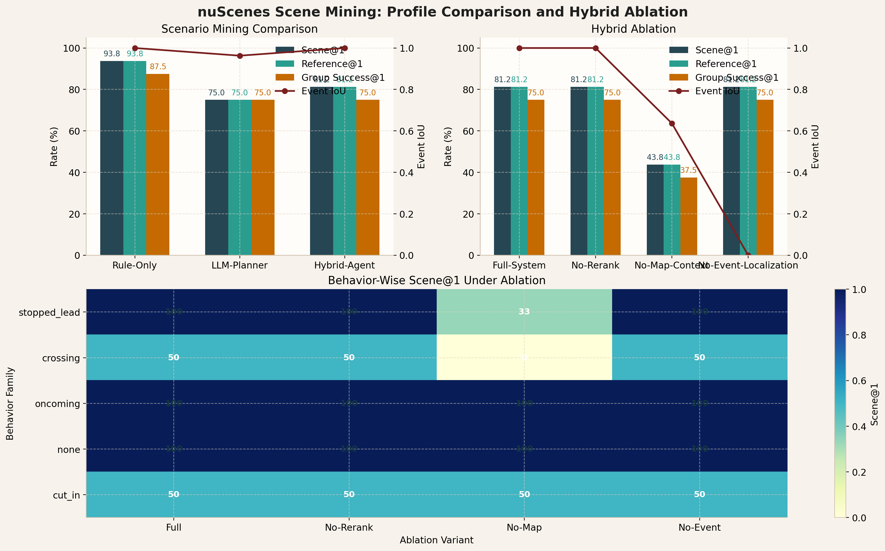

<div align="center">

# nuScenes Scene Mining Agent

Turn natural-language risk descriptions into validated `nuScenes` cases, evidence figures, and benchmark-ready case libraries.

`Python 3.10+` `Conda` `nuScenes` `Responses API` `Scene Mining & Benchmarking`

</div>

<p align="center">
  
</p>

`nuScenes Scene Mining Agent` is a toolkit for risky-scene retrieval, validation, and benchmark generation on `nuScenes`.

It is not a driving policy, an end-to-end training stack, or a simulator-first project. The focus is the data workflow:

1. describe a risky scenario in natural language
2. translate it into structured retrieval hypotheses
3. search a `SQLite` scene index built from `nuScenes`
4. validate candidates with geometry, motion, TTC, and map context
5. export evidence figures, reports, case libraries, event windows, and benchmark summaries

## Scope

- Mine corner cases from `nuScenes` without manually scanning scenes one by one.
- Turn open-ended safety language into a reproducible retrieval workflow.
- Keep the system interpretable with deterministic validation instead of black-box matching alone.
- Build benchmark suites and failure-analysis artifacts for research and evaluation.
- Compare `rule_only`, `llm_planner`, and `hybrid_agent` on the same risky-scene benchmark.
- Generate counterfactual benchmark variants anchored to validated reference cases.

## Example Outputs

<p align="center">
  
</p>

Representative outputs produced by the pipeline include:

| Scenario family | What the export shows |
| --- | --- |
| Pedestrian crossing | crosswalk-aware front crossing with risky proximity |
| Stopped lead vehicle | same-lane blocking behavior ahead of ego |
| Oncoming vehicle | opposite-direction conflict with map-aware validation |
| Right-side cut-in | lateral merge into ego path with temporal evidence |

The reporting pipeline exports `BEV evidence PNG` together with `Markdown` and `HTML` reports.

## Agent Design

This repository implements an orchestration agent rather than a driving policy.

It combines:

- an `LLM planner` that converts free-form scene descriptions into structured retrieval hypotheses
- a retrieval engine over a prebuilt `SQLite` scene index
- an optional `LLM reranker` for semantic fit
- deterministic validators for geometry, motion, TTC, lane relation, and crosswalk context
- a reporting layer that exports evidence images, case reports, case libraries, and benchmark summaries

The core design is hybrid: `LLM` for intent understanding and ranking, `deterministic code` for evidence, filtering, and reproducibility.

## Planning-Centric Outputs

The validation and reporting pipeline now exports structured scenario-mining fields in addition to case-level reports:

- actor grounding for the retrieved primary actor
- event localization with start, end, and peak sample indices
- scene-level reference fields for scenario mining benchmarks
- reference-aware benchmark fields for contrastive evaluation
- counterfactual benchmark groups anchored to validated cases

## Scenario Mining Benchmark Generation

The repository generates a planning-centric scenario mining benchmark from a validated case library. The benchmark targets positive scenario retrieval with explicit reference scene, actor, and event-window supervision.

Generate a scenario mining benchmark:

```bash
python -m nusc_scene_agent generate-scenario-mining-benchmark \
  --case-library outputs/trainval_suite_llm_hybrid_en_v1/case_library.json \
  --output benchmarks/trainval_scenario_mining_v1.yaml \
  --max-cases 8
```

Run the generated benchmark:

```bash
python -m nusc_scene_agent benchmark \
  --config benchmarks/trainval_scenario_mining_v1.yaml \
  --db artifacts/index/v1.0-trainval.sqlite \
  --output outputs/trainval_scenario_mining_v1_rule \
  --query-mode rule \
  --rerank-mode none
```

For scenario-mining-style benchmarks, the metrics layer now reports:

- scene objective@1 and objective@K
- actor objective@1 and objective@K
- event-window IoU and peak-sample error
- query-level and group-level reference tracking
- scenario-group summaries for paraphrase robustness and anchor consistency

Run a three-profile scenario-mining comparison:

```bash
python -m nusc_scene_agent benchmark-compare \
  --config benchmarks/trainval_scenario_mining_v1.yaml \
  --db artifacts/index/v1.0-trainval.sqlite \
  --output outputs/trainval_scenario_profile_comparison_v1
```

The comparison export includes:

- `benchmark_profile_comparison_summary.md`
- `benchmark_leaderboard.csv`
- `benchmark_leaderboard.html`
- `behavior_error_analysis.md`
- `behavior_error_analysis.csv`
- `behavior_error_analysis.html`

Generate a static browser over the comparison outputs:

```bash
python -m nusc_scene_agent build-gallery \
  --comparison-output outputs/trainval_scenario_profile_comparison_v1 \
  --title "nuScenes Scenario Mining Browser"
```

This generates:

- `outputs/trainval_scenario_profile_comparison_v1/comparison_browser.html`
- `outputs/trainval_scenario_profile_comparison_v1/comparison_browser.json`
- `outputs/trainval_scenario_mining_v1_rule/query_gallery.html`
- `outputs/trainval_scenario_mining_v1_llm/query_gallery.html`
- `outputs/trainval_scenario_mining_v1_hybrid/query_gallery.html`

<p align="center">
  
</p>

Local `v1.0-trainval` snapshot:

| Profile | Pass@1 | Scene@1 | Actor@1 | Reference@1 | Scenario Group Success@1 | Mean Event IoU |
| --- | --- | --- | --- | --- | --- | --- |
| `rule_only` | `16/16` | `15/16` | `15/16` | `15/16` | `7/8` | `1.000` |
| `llm_planner` | `16/16` | `12/16` | `12/16` | `12/16` | `6/8` | `0.963` |
| `hybrid_agent` | `16/16` | `13/16` | `13/16` | `13/16` | `6/8` | `1.000` |

In the current local evaluation, all three profiles retrieve high-scoring risky cases, but the deterministic baseline remains strongest on scene-level and actor-level grounding. A detailed summary is provided in [docs/benchmark_snapshot.md](docs/benchmark_snapshot.md).

## Ablation Track

The repository provides ablations over the hybrid scenario-mining pipeline:

```bash
python -m nusc_scene_agent benchmark-ablate \
  --config benchmarks/trainval_scenario_mining_v1.yaml \
  --db artifacts/index/v1.0-trainval.sqlite \
  --output outputs/trainval_hybrid_ablation_v1 \
  --base-query-mode hybrid \
  --base-rerank-mode llm
```

This exports:

- `ablation_manifest.json`
- `benchmark_profile_comparison_summary.md`
- `benchmark_leaderboard.html`
- `behavior_error_analysis.html`
- `comparison_browser.html`

Regenerate the figure used in this README:

```bash
python scripts/generate_paper_figures.py
```

Current local `hybrid` ablation snapshot:

| Variant | Pass@1 | Scene@1 | Reference@1 | Scenario Group Success@1 | Mean Event IoU | Mean Best Score |
| --- | --- | --- | --- | --- | --- | --- |
| `full_system` | `16/16` | `13/16` | `13/16` | `6/8` | `1.000` | `92.67` |
| `no_rerank` | `16/16` | `13/16` | `13/16` | `6/8` | `1.000` | `92.67` |
| `no_map_context` | `12/16` | `7/16` | `7/16` | `3/8` | `0.636` | `79.97` |
| `no_event_localization` | `16/16` | `13/16` | `13/16` | `6/8` | `0.000` | `92.67` |

In the current local ablation, the map-aware validator is the dominant component for this benchmark. Reranking does not change the final ranking on the present query set, while event localization affects localization-aware metrics rather than retrieval success.

## Data Policy

This repository does **not** include:

- `nuScenes` archives
- extracted dataset files
- map files
- local `SQLite` artifacts
- generated benchmark outputs

These directories are excluded from version control through `.gitignore` so the repository remains lightweight.

Download links are listed here:

- [Dataset Downloads](docs/dataset_downloads.md)

Minimal required files:

- mini: `v1.0-mini.tgz`
- maps: `nuScenes-map-expansion-v1.3.zip`
- full trainval: `v1.0-trainval_meta.tgz` plus `v1.0-trainval01_blobs.tgz` to `v1.0-trainval10_blobs.tgz`

## Quickstart

### 1. Create the environment

```bash
conda env create -f environment.yml
conda activate nuscenes
```

If the environment already exists:

```bash
conda env update -f environment.yml --prune
conda activate nuscenes
```

### 2. Download data and place it locally

See:

- [Dataset Downloads](docs/dataset_downloads.md)

Expected local layout:

```text
archives/
  mini/
    v1.0-mini.tgz
  maps/
    nuScenes-map-expansion-v1.3.zip
  trainval/
    v1.0-trainval_meta.tgz
    v1.0-trainval01_blobs.tgz
    ...
    v1.0-trainval10_blobs.tgz
```

Check readiness:

```bash
python -m nusc_scene_agent inspect-archives --workspace .
```

### 3. Run a minimal end-to-end demo

Prepare `v1.0-mini`:

```bash
python -m nusc_scene_agent prepare-data \
  --workspace . \
  --profile mini
```

Build the mini index:

```bash
python -m nusc_scene_agent build-index \
  --version v1.0-mini \
  --dataroot data/sets/nuscenes \
  --db artifacts/index/v1.0-mini.sqlite
```

Run one query:

```bash
python -m nusc_scene_agent query \
  "pedestrian crossing very close in front of ego lane and risky" \
  --db artifacts/index/v1.0-mini.sqlite \
  --output outputs/demo_query \
  --query-mode rule
```

### 4. Run on trainval

Prepare `v1.0-trainval + map expansion`:

```bash
python -m nusc_scene_agent prepare-data \
  --workspace . \
  --profile trainval-full
```

Build the full index:

```bash
python -m nusc_scene_agent build-index \
  --version v1.0-trainval \
  --dataroot data/sets/nuscenes \
  --db artifacts/index/v1.0-trainval.sqlite
```

Run the full benchmark:

```bash
python -m nusc_scene_agent benchmark \
  --config benchmarks/trainval_suite_v1.yaml \
  --db artifacts/index/v1.0-trainval.sqlite \
  --output outputs/trainval_suite_llm_hybrid_en_v1 \
  --query-mode hybrid \
  --rerank-mode llm
```

Run the language-stress comparison:

```bash
python -m nusc_scene_agent benchmark-compare \
  --config benchmarks/trainval_language_stress_v1.yaml \
  --db artifacts/index/v1.0-trainval.sqlite \
  --output outputs/trainval_language_stress_comparison_v2
```

## LLM Configuration

`LLM` support is optional. Rule-only retrieval works without any API configuration.

To enable `--query-mode llm|hybrid` or `--rerank-mode llm`, set:

```bash
export NUSC_SCENE_AGENT_LLM_BASE_URL="https://your-openai-compatible-endpoint"
export NUSC_SCENE_AGENT_LLM_API_KEY="your-key"
export NUSC_SCENE_AGENT_LLM_MODEL="your-model"
```

The runtime uses an OpenAI-compatible `Responses API` flow and keeps retrieval and validation available even if planning or reranking fails.

## Optional LangGraph Workflow

The repository includes a thin `LangGraph` orchestration layer on top of the existing planner, retrieval, validation, and reporting modules.

Install the optional dependency:

```bash
pip install -e ".[agent]"
```

Run a query through `LangGraph`:

```bash
python -m nusc_scene_agent langgraph-query \
  "pedestrian crossing very close in front of ego lane and risky" \
  --db artifacts/index/v1.0-mini.sqlite \
  --output outputs/langgraph_query \
  --query-mode hybrid \
  --rerank-mode llm
```

This path writes the standard report artifacts together with `langgraph_trace.json` for framework-level orchestration tracing.

## Counterfactual Benchmark Generation

The repository supports counterfactual benchmark generation from curated case libraries. This benchmark family extends case retrieval to benchmark construction with positive variants, paraphrase variants, and contrastive negative probes anchored to reference cases.

Generate a benchmark from an existing case library:

```bash
python -m nusc_scene_agent generate-counterfactual-benchmark \
  --case-library outputs/trainval_suite_llm_hybrid_en_v1/case_library.json \
  --output benchmarks/trainval_counterfactual_reference_v1.yaml \
  --max-cases 6
```

Run the generated benchmark:

```bash
python -m nusc_scene_agent benchmark \
  --config benchmarks/trainval_counterfactual_reference_v1.yaml \
  --db artifacts/index/v1.0-trainval.sqlite \
  --output outputs/trainval_counterfactual_reference_v1_hybrid \
  --query-mode hybrid \
  --rerank-mode llm
```

For generated benchmarks with `reference_case_keys`, the metrics layer reports:

- scene objective@1 and objective@K
- actor objective@1 and objective@K
- reference objective@1 and objective@K
- event localization metrics for positive reference queries
- contrastive group success@1 and success@K
- query-level reference hit behavior for positive and negative variants

## Benchmark Snapshot

Current local snapshot on `v1.0-trainval + map expansion`:

### Core Suite

| Metric | Value |
| --- | --- |
| Queries | `16` |
| Pass@1 | `16/16` |
| Pass@K | `16/16` |
| Selected cases | `36` |
| Unique cases | `33` |
| Unique passed cases | `29` |
| Mean best validation score | `89.26` |

### Language-Stress Comparison

| Profile | Pass@1 | Mean best score |
| --- | --- | --- |
| `rule_only` | `16/16` | `90.64` |
| `llm_planner` | `15/16` | `86.29` |
| `hybrid_agent` | `16/16` | `91.34` |

Additional observations:

- planner signal divergence: `12 / 16`
- hybrid arbitration improves robustness over naive planner-only behavior
- hard-case taxonomy exposes overlap, borderline, and behavior-gap failure modes

More context:

- [Architecture Notes](docs/architecture.md)
- [Benchmark Snapshot Notes](docs/benchmark_snapshot.md)

## Repository Layout

```text
src/nusc_scene_agent/    core library and CLI
benchmarks/              benchmark configs
assets/                  repo-safe showcase figures
docs/                    architecture and dataset notes
tests/                   unit tests for retrieval, validation, reporting, and benchmarks
environment.yml          conda-first environment
```

Large local directories are intentionally not tracked:

- `archives/`
- `data/`
- `artifacts/`
- `outputs/`

## Command Surface

The CLI currently supports:

- `inspect-archives`
- `prepare-data`
- `build-index`
- `query`
- `langgraph-query`
- `benchmark`
- `benchmark-compare`
- `generate-counterfactual-benchmark`
- `generate-scenario-mining-benchmark`
- `demo`

These commands cover archive inspection, dataset preparation, indexing, retrieval, validation, and benchmark export.
