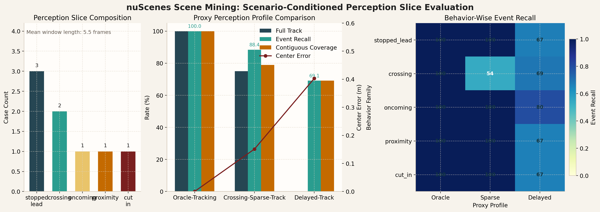
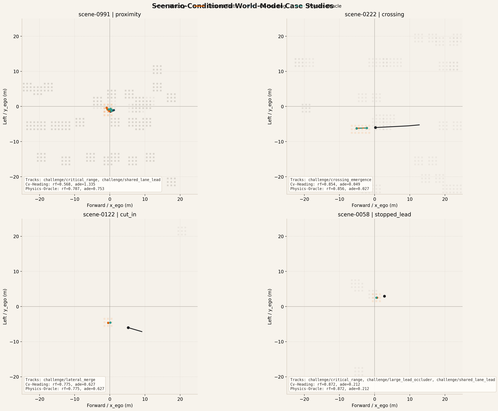

<div align="center">

# nuScenes Scene Mining Agent

Turn natural-language risk descriptions into validated `nuScenes` cases, evidence figures, and benchmark-ready case libraries.

`Python 3.10+` `Conda` `nuScenes` `Responses API` `Scene Mining & Benchmarking`

</div>

<p align="center">
  
</p>

`nuScenes Scene Mining Agent` is a toolkit for risky-scene retrieval, validation, and benchmark generation on `nuScenes`.

It is not a driving policy, an end-to-end training stack, or a simulator-first project. The focus is the data workflow:

1. describe a risky scenario in natural language
2. translate it into structured retrieval hypotheses
3. search a `SQLite` scene index built from `nuScenes`
4. validate candidates with geometry, motion, TTC, and map context
5. export evidence figures, reports, case libraries, event windows, and benchmark summaries

## Scope

- Mine corner cases from `nuScenes` without manually scanning scenes one by one.
- Turn open-ended safety language into a reproducible retrieval workflow.
- Keep the system interpretable with deterministic validation instead of black-box matching alone.
- Build benchmark suites and failure-analysis artifacts for research and evaluation.
- Compare `rule_only`, `llm_planner`, and `hybrid_agent` on the same risky-scene benchmark.
- Generate counterfactual benchmark variants anchored to validated reference cases.
- Evaluate scenario-conditioned perception slices derived from mined risk cases.
- Evaluate scenario-conditioned world-model rollouts and export replay-ready artifacts.

## Representative Outputs

<p align="center">
  
</p>

Representative outputs produced by the pipeline include:

| Scenario family | What the export shows |
| --- | --- |
| Pedestrian crossing | crosswalk-aware front crossing with risky proximity |
| Stopped lead vehicle | same-lane blocking behavior ahead of ego |
| Oncoming vehicle | opposite-direction conflict with map-aware validation |
| Right-side cut-in | lateral merge into ego path with temporal evidence |

The reporting pipeline exports `BEV evidence PNG` together with `Markdown` and `HTML` reports.

## Orchestration Design

This repository implements an orchestration agent rather than a driving policy.

It combines:

- an `LLM planner` that converts free-form scene descriptions into structured retrieval hypotheses
- a retrieval engine over a prebuilt `SQLite` scene index
- an optional `LLM reranker` for semantic fit
- deterministic validators for geometry, motion, TTC, lane relation, and crosswalk context
- a reporting layer that exports evidence images, case reports, case libraries, and benchmark summaries

The core design is hybrid: `LLM` for intent understanding and ranking, `deterministic code` for evidence, filtering, and reproducibility.

## Exported Benchmark Artifacts

The validation and reporting pipeline now exports structured scenario-mining fields in addition to case-level reports:

- actor grounding for the retrieved primary actor
- event localization with start, end, and peak sample indices
- scene-level reference fields for scenario mining benchmarks
- reference-aware benchmark fields for contrastive evaluation
- counterfactual benchmark groups anchored to validated cases
- scenario-conditioned perception slices with event-window actor tracks in ego coordinates
- scenario-conditioned world-model slices with observed history, future rollouts, and sparse occupancy supervision

## Scenario Mining Benchmark Generation

The repository generates a reference-aware scenario mining benchmark from a validated case library. The benchmark targets positive scenario retrieval with explicit reference scene, actor, and event-window supervision.

Generate a scenario mining benchmark:

```bash
python -m nusc_scene_agent generate-scenario-mining-benchmark \
  --case-library outputs/trainval_suite_llm_hybrid_en_v1/case_library.json \
  --output benchmarks/trainval_scenario_mining_v1.yaml \
  --max-cases 8
```

Run the generated benchmark:

```bash
python -m nusc_scene_agent benchmark \
  --config benchmarks/trainval_scenario_mining_v1.yaml \
  --db artifacts/index/v1.0-trainval.sqlite \
  --output outputs/trainval_scenario_mining_v1_rule \
  --query-mode rule \
  --rerank-mode none
```

For scenario-mining-style benchmarks, the metrics layer now reports:

- scene objective@1 and objective@K
- actor objective@1 and objective@K
- event-window IoU and peak-sample error
- query-level and group-level reference tracking
- scenario-group summaries for paraphrase robustness and anchor consistency

Run a three-profile scenario-mining comparison:

```bash
python -m nusc_scene_agent benchmark-compare \
  --config benchmarks/trainval_scenario_mining_v1.yaml \
  --db artifacts/index/v1.0-trainval.sqlite \
  --output outputs/trainval_scenario_profile_comparison_v1
```

The comparison export includes:

- `benchmark_profile_comparison_summary.md`
- `benchmark_leaderboard.csv`
- `benchmark_leaderboard.html`
- `behavior_error_analysis.md`
- `behavior_error_analysis.csv`
- `behavior_error_analysis.html`

Generate a static browser over the comparison outputs:

```bash
python -m nusc_scene_agent build-gallery \
  --comparison-output outputs/trainval_scenario_profile_comparison_v1 \
  --title "nuScenes Scenario Mining Browser"
```

This generates:

- `outputs/trainval_scenario_profile_comparison_v1/comparison_browser.html`
- `outputs/trainval_scenario_profile_comparison_v1/comparison_browser.json`
- `outputs/trainval_scenario_mining_v1_rule/query_gallery.html`
- `outputs/trainval_scenario_mining_v1_llm/query_gallery.html`
- `outputs/trainval_scenario_mining_v1_hybrid/query_gallery.html`

<p align="center">
  
</p>

Local `v1.0-trainval` snapshot:

| Profile | Pass@1 | Scene@1 | Actor@1 | Reference@1 | Scenario Group Success@1 | Mean Event IoU |
| --- | --- | --- | --- | --- | --- | --- |
| `rule_only` | `16/16` | `15/16` | `15/16` | `15/16` | `7/8` | `1.000` |
| `llm_planner` | `16/16` | `12/16` | `12/16` | `12/16` | `6/8` | `0.963` |
| `hybrid_agent` | `16/16` | `13/16` | `13/16` | `13/16` | `6/8` | `1.000` |

In local evaluation, all three profiles retrieve high-scoring risky cases, but the deterministic baseline remains strongest on scene-level and actor-level grounding. A detailed summary is provided in [docs/benchmark_snapshot.md](docs/benchmark_snapshot.md).

## Scenario-Conditioned Perception Slice Evaluation

The repository also exposes a perception-oriented benchmark layer derived from validated scenario-mining anchors. Instead of training a detector inside this repository, the benchmark exports short event-window actor tracks that can be used to evaluate external BEV detection or tracking outputs on mined risk slices.

Generate the perception-slice benchmark:

```bash
python -m nusc_scene_agent generate-perception-benchmark \
  --config benchmarks/trainval_scenario_mining_v1.yaml \
  --db artifacts/index/v1.0-trainval.sqlite \
  --output benchmarks/trainval_perception_slices_v1.json
```

Run the built-in proxy study:

```bash
python -m nusc_scene_agent run-proxy-perception-study \
  --benchmark benchmarks/trainval_perception_slices_v1.json \
  --output outputs/trainval_perception_proxy_study_v1
```

Evaluate official `nuScenes` tracking or detection outputs:

```bash
python -m nusc_scene_agent evaluate-nuscenes-predictions-covered \
  --benchmark benchmarks/trainval_perception_slices_v1.json \
  --db artifacts/index/v1.0-trainval.sqlite \
  --input /path/to/tracking_results.json \
  --task tracking \
  --coverage-mode full_window \
  --output outputs/external_tracking_eval
```

For split-specific prediction files such as official `results_val_*.json`, the `covered` command is the recommended entry point because it first filters the benchmark to the subset that is actually covered by the prediction file.

This exports:

- `benchmarks/trainval_perception_slices_v1.json`
- `outputs/trainval_perception_proxy_study_v1/perception_comparison_summary.md`
- `outputs/trainval_perception_proxy_study_v1/perception_comparison_summary.html`
- `outputs/trainval_perception_proxy_study_v1/perception_leaderboard.csv`
- per-profile `JSON`, `Markdown`, `HTML`, and `CSV` summaries under `oracle_tracking`, `crossing_sparse_track`, and `delayed_track`
- benchmark cases with `risk_facets` such as distance band, TTC band, map relation, and occlusion proxy
- aligned external-evaluation exports such as `adapted_predictions.json` and `filtered_benchmark.json`

Local `v1.0-trainval` snapshot:

| Profile | Anchor Recall | Full Track | Mean Event Recall | Mean Contiguous Coverage | Mean Center Error |
| --- | --- | --- | --- | --- | --- |
| `oracle_tracking` | `8/8` | `8/8` | `1.000` | `1.000` | `0.000` |
| `crossing_sparse_track` | `8/8` | `6/8` | `0.884` | `0.789` | `0.151` |
| `delayed_track` | `8/8` | `0/8` | `0.691` | `0.691` | `0.403` |

The slice set contains `8` anchored cases spanning `stopped_lead`, `crossing`, `oncoming`, `cut_in`, and close-proximity interactions. Each case carries a compact `risk_facets` block with distance band, TTC band, visibility band, map relation, and occlusion proxy labels.

In the local proxy study:

- temporal sparsity is concentrated on the two `crossing` slices, which appear as `crossing_emergence` cases in the risk breakdown
- `near_range` slices regress under sparse tracking, while `critical_range` slices remain stable in the current proxy setup
- `large_lead_occluder` slices remain stable under sparse tracking but fail under delayed initialization, which separates fragmentation from track warm-up behavior
- official `nuScenes` prediction JSON can be evaluated through the adapter path without manual format conversion

Local official-baseline example:

- downloaded file: `external_predictions/nuscenes_official/megvii_tracking/unpacked/results_val_megvii.json`
- aligned evaluation output: `outputs/external_megvii_tracking_eval_covered`
- coverage-aligned subset size: `2 / 8` slices
- local result on that subset: `anchor recall 1/2`, `full-track success 1/2`, `mean event recall 0.500`

Add a second official baseline and compare them:

```bash
python -m nusc_scene_agent evaluate-nuscenes-predictions-covered \
  --benchmark benchmarks/trainval_perception_slices_v1.json \
  --db artifacts/index/v1.0-trainval.sqlite \
  --input external_predictions/nuscenes_official/pointpillars_tracking/unpacked/results_val_pointpillars.json \
  --task tracking \
  --profile-name pointpillars_tracking_val_covered \
  --coverage-mode full_window \
  --output outputs/external_pointpillars_tracking_eval_covered

python -m nusc_scene_agent compare-perception-evaluations \
  --eval-dir outputs/external_megvii_tracking_eval_covered \
  --eval-dir outputs/external_pointpillars_tracking_eval_covered \
  --output outputs/external_official_tracking_comparison
```

Local official-baseline comparison on the shared covered subset:

| Profile | Cases | Anchor Recall | Full Track | Mean Event Recall | Mean Contiguous Coverage | Mean Center Error |
| --- | --- | --- | --- | --- | --- | --- |
| `pointpillars_tracking_val_covered` | `2` | `1/2` | `1/2` | `0.600` | `0.600` | `0.323` |
| `megvii_tracking_val_covered` | `2` | `1/2` | `1/2` | `0.500` | `0.500` | `0.271` |

On the shared subset, both methods solve the `stopped_lead` slice, while `PointPillars` recovers a partial track on the `oncoming` slice and `Megvii` misses it entirely.

<p align="center">
  
</p>

## Scenario-Conditioned World-Model Evaluation

The repository also exposes a world-model benchmark derived from the perception-slice layer. Each case keeps a short observed history, a short future horizon for the primary risk actor, sparse future occupancy for the actor and its local context, and the inherited risk facets from the validated scenario anchor.

The benchmark also defines named challenge tracks such as `challenge/crossing_emergence`, `challenge/large_lead_occluder`, `challenge/lateral_merge`, and `challenge/opposite_direction_conflict`.

Generate the world-model benchmark:

```bash
python -m nusc_scene_agent generate-world-model-benchmark \
  --benchmark benchmarks/trainval_perception_slices_v1.json \
  --db artifacts/index/v1.0-trainval.sqlite \
  --output benchmarks/trainval_world_model_slices_v1.json
```

Run the built-in proxy study:

```bash
python -m nusc_scene_agent run-proxy-world-model-study \
  --benchmark benchmarks/trainval_world_model_slices_v1.json \
  --output outputs/trainval_world_model_proxy_study_v1
```

Adapt compact external rollouts to the local schema:

```bash
python -m nusc_scene_agent adapt-world-model-predictions \
  --benchmark benchmarks/trainval_world_model_slices_v1.json \
  --input /path/to/compact_rollout.json \
  --output outputs/adapted_world_model_predictions.json
```

Adapt `nuScenes prediction challenge` style forecasts:

```bash
python -m nusc_scene_agent adapt-nuscenes-forecast-predictions \
  --benchmark benchmarks/trainval_world_model_slices_v1.json \
  --input /path/to/nuscenes_forecasts.json \
  --mode-selection top_probability \
  --output outputs/adapted_nuscenes_forecasts.json
```

Adapt and evaluate in one step:

```bash
python -m nusc_scene_agent evaluate-nuscenes-forecast-predictions \
  --benchmark benchmarks/trainval_world_model_slices_v1.json \
  --input /path/to/nuscenes_forecasts.json \
  --mode-selection oracle_ade \
  --output outputs/nuscenes_forecast_eval
```

Supported mode-selection policies:

- `top_probability`
- `oracle_ade`
- `oracle_fde`

For predictions that carry multiple modes, the evaluation export also reports benchmark-aligned forecast metrics:

- `MinADE@1`, `MinADE@5`, `MinADE@10`
- `MinFDE@1`, `MinFDE@5`, `MinFDE@10`
- `MissRate@1`, `MissRate@5`, `MissRate@10`

Export replay-ready artifacts:

```bash
python -m nusc_scene_agent export-world-model-replay \
  --benchmark benchmarks/trainval_world_model_slices_v1.json \
  --output outputs/trainval_world_model_replay_v1 \
  --format jsonl
```

Optional `MCAP` export support:

```bash
pip install -e ".[ros]"
```

This exports:

- `benchmarks/trainval_world_model_slices_v1.json`
- `outputs/trainval_world_model_proxy_study_v1/world_model_comparison_summary.md`
- `outputs/trainval_world_model_proxy_study_v1/world_model_comparison_summary.html`
- `outputs/trainval_world_model_proxy_study_v1/world_model_leaderboard.csv`
- benchmark metadata with named challenge-track definitions
- per-profile `JSON`, `Markdown`, `HTML`, and `CSV` summaries under `oracle_rollout`, `kinematic_rollout`, and `risk_underreach_rollout`
- adapters for compact custom rollouts and `nuScenes prediction challenge` style forecast files
- replay artifacts such as `replay_manifest.json` and per-case `JSONL` files

Local `v1.0-trainval` snapshot:

| Profile | Full Horizon | Mean Horizon Recall | Mean ADE | Mean FDE | Mean Occupancy IoU | Mean Risk Fidelity |
| --- | --- | --- | --- | --- | --- | --- |
| `oracle_rollout` | `8/8` | `1.000` | `0.000` | `0.000` | `1.000` | `1.000` |
| `risk_underreach_rollout` | `8/8` | `1.000` | `0.782` | `0.905` | `0.889` | `0.853` |
| `kinematic_rollout` | `8/8` | `1.000` | `0.838` | `0.959` | `0.883` | `0.853` |

The current slice set retains all `8` mined anchors. When the original event anchor falls at the end of the localized window, the rollout anchor is moved back by one frame so the benchmark keeps a non-zero forecast horizon without changing the mined case identity.

In the local proxy study:

- `crossing` remains comparatively stable for both non-oracle profiles, with mean risk fidelity above `0.93`
- `cut_in` is the lowest-performing family in the current proxy study and produces the lowest occupancy agreement
- `stopped_lead` and generic `proximity` slices expose risk-alignment errors even when horizon coverage remains complete
- the evaluation export now includes challenge-track breakdowns in addition to behavior and risk-facet breakdowns
- the replay export writes `66` messages across `8` case files in the current local snapshot

Official `nuScenes` physics-baseline example on the benchmark anchors:

```bash
python -m nusc_scene_agent run-nuscenes-forecast-baselines \
  --benchmark benchmarks/trainval_world_model_slices_v1.json \
  --dataroot data/sets/nuscenes \
  --version v1.0-trainval \
  --output outputs/nuscenes_forecast_baselines_eval \
  --mode-selection top_probability
```

Local snapshot on the same `8` benchmark anchors:

| Profile | Full Horizon | Mean ADE | Mean MinADE@1 | Mean MissRate@5 | Mean Occupancy IoU | Mean Risk Fidelity |
| --- | --- | --- | --- | --- | --- | --- |
| `physics_oracle` | `8/8` | `0.212` | `0.212` | `0.000` | `0.175` | `0.840` |
| `cv_heading` | `8/8` | `0.288` | `0.288` | `0.125` | `0.175` | `0.823` |

Observed comparison:

- `physics_oracle` improves trajectory and closest-approach accuracy over `cv_heading`
- the new forecast-metric block shows the same ranking under `MinADE@1` and `MissRate@5`
- occupancy IoU remains low for both because the current occupancy target includes surrounding context actors, whereas these baselines only predict the primary actor trajectory
- `challenge/shared_lane_lead` is the clearest separation point, where `physics_oracle` reaches `0.834` risk fidelity and `cv_heading` reaches `0.799`

Real multi-modal paper baseline example (`ContextVAE`, IEEE RA-L 2023):

```bash
pip install -e ".[forecast]"
```

```bash
git clone https://github.com/xupei0610/ContextVAE.git external/ContextVAE
python -m nusc_scene_agent run-contextvae-world-model-study \
  --benchmark benchmarks/trainval_world_model_slices_v1.json \
  --dataroot data/sets/nuscenes \
  --version v1.0-trainval \
  --output outputs/contextvae_world_model_study_v1 \
  --repo external/ContextVAE \
  --checkpoint external/ContextVAE/models/nuscenes_res18 \
  --device cuda \
  --batch-size 4 \
  --mode-count 5 \
  --clustering-samples 2000
```

If the checkpoint is missing, the integration downloads the public `nuscenes_res18` release automatically. The command writes:

- a forecast-compatible benchmark subset under `outputs/contextvae_world_model_study_v1/contextvae_dataset`
- raw `nuScenes prediction challenge` style forecasts from the external model
- adapted world-model evaluation outputs under `outputs/contextvae_world_model_study_v1/contextvae`
- same-subset `cv_heading` and `physics_oracle` baselines under `outputs/contextvae_world_model_study_v1/nuscenes_baselines`
- a three-way comparison under `outputs/contextvae_world_model_study_v1/comparison`

Local snapshot on the forecast-compatible subset (`7/8` original cases):

| Profile | Cases | Mean ADE | Mean MinADE@5 | Mean Occupancy IoU | Mean Risk Fidelity |
| --- | --- | --- | --- | --- | --- |
| `physics_oracle` | `7` | `0.135` | `0.135` | `0.197` | `0.860` |
| `cv_heading` | `7` | `0.139` | `0.139` | `0.197` | `0.859` |
| `contextvae` | `7` | `0.280` | `0.207` | `0.181` | `0.841` |

Observed comparison on the same subset:

- `ContextVAE` retains full horizon coverage on every compatible case
- `MinADE@5` improves from `0.280` to `0.207`, confirming that the exported multi-modal heads are preserved through the local adapter
- the main residual gap remains occupancy agreement because the benchmark occupancy target includes surrounding context actors, while the external forecast only predicts the primary actor trajectory

Qualitative case studies generated from the same outputs:

<p align="center">
  
</p>

<p align="center">
  
</p>

## Ablation Track

The repository provides ablations over the hybrid scenario-mining pipeline:

```bash
python -m nusc_scene_agent benchmark-ablate \
  --config benchmarks/trainval_scenario_mining_v1.yaml \
  --db artifacts/index/v1.0-trainval.sqlite \
  --output outputs/trainval_hybrid_ablation_v1 \
  --base-query-mode hybrid \
  --base-rerank-mode llm
```

This exports:

- `ablation_manifest.json`
- `benchmark_profile_comparison_summary.md`
- `benchmark_leaderboard.html`
- `behavior_error_analysis.html`
- `comparison_browser.html`

Regenerate the figure used in this README:

```bash
python scripts/generate_paper_figures.py
```

Local `hybrid` ablation snapshot:

| Variant | Pass@1 | Scene@1 | Reference@1 | Scenario Group Success@1 | Mean Event IoU | Mean Best Score |
| --- | --- | --- | --- | --- | --- | --- |
| `full_system` | `16/16` | `13/16` | `13/16` | `6/8` | `1.000` | `92.67` |
| `no_rerank` | `16/16` | `13/16` | `13/16` | `6/8` | `1.000` | `92.67` |
| `no_map_context` | `12/16` | `7/16` | `7/16` | `3/8` | `0.636` | `79.97` |
| `no_event_localization` | `16/16` | `13/16` | `13/16` | `6/8` | `0.000` | `92.67` |

In the current ablation snapshot, the map-aware validator has the largest effect on benchmark performance. Reranking does not change the final ranking on this query set, while event localization affects localization-aware metrics rather than retrieval success.

## Data Policy

This repository does **not** include:

- `nuScenes` archives
- extracted dataset files
- map files
- local `SQLite` artifacts
- generated benchmark outputs

These directories are excluded from version control through `.gitignore` to keep the repository compact.

Download links are listed here:

- [Dataset Downloads](docs/dataset_downloads.md)

Minimal required files:

- mini: `v1.0-mini.tgz`
- maps: `nuScenes-map-expansion-v1.3.zip`
- full trainval: `v1.0-trainval_meta.tgz` plus `v1.0-trainval01_blobs.tgz` to `v1.0-trainval10_blobs.tgz`

## Quickstart

### 1. Create the environment

```bash
conda env create -f environment.yml
conda activate nuscenes
```

If the environment already exists:

```bash
conda env update -f environment.yml --prune
conda activate nuscenes
```

### 2. Download data and place it locally

See:

- [Dataset Downloads](docs/dataset_downloads.md)

Expected local layout:

```text
archives/
  mini/
    v1.0-mini.tgz
  maps/
    nuScenes-map-expansion-v1.3.zip
  trainval/
    v1.0-trainval_meta.tgz
    v1.0-trainval01_blobs.tgz
    ...
    v1.0-trainval10_blobs.tgz
```

Check readiness:

```bash
python -m nusc_scene_agent inspect-archives --workspace .
```

### 3. Run a minimal mini-split example

Prepare `v1.0-mini`:

```bash
python -m nusc_scene_agent prepare-data \
  --workspace . \
  --profile mini
```

Build the mini index:

```bash
python -m nusc_scene_agent build-index \
  --version v1.0-mini \
  --dataroot data/sets/nuscenes \
  --db artifacts/index/v1.0-mini.sqlite
```

Run one query:

```bash
python -m nusc_scene_agent query \
  "pedestrian crossing at close range ahead of ego lane" \
  --db artifacts/index/v1.0-mini.sqlite \
  --output outputs/mini_query \
  --query-mode rule
```

### 4. Run on trainval

Prepare `v1.0-trainval + map expansion`:

```bash
python -m nusc_scene_agent prepare-data \
  --workspace . \
  --profile trainval-full
```

Build the full index:

```bash
python -m nusc_scene_agent build-index \
  --version v1.0-trainval \
  --dataroot data/sets/nuscenes \
  --db artifacts/index/v1.0-trainval.sqlite
```

Run the full benchmark:

```bash
python -m nusc_scene_agent benchmark \
  --config benchmarks/trainval_suite_v1.yaml \
  --db artifacts/index/v1.0-trainval.sqlite \
  --output outputs/trainval_suite_llm_hybrid_en_v1 \
  --query-mode hybrid \
  --rerank-mode llm
```

Run the language-robustness comparison:

```bash
python -m nusc_scene_agent benchmark-compare \
  --config benchmarks/trainval_language_stress_v1.yaml \
  --db artifacts/index/v1.0-trainval.sqlite \
  --output outputs/trainval_language_stress_comparison_v2
```

## LLM Configuration

`LLM` support is optional. Rule-only retrieval does not require API configuration.

To enable `--query-mode llm|hybrid` or `--rerank-mode llm`, set:

```bash
export NUSC_SCENE_AGENT_LLM_BASE_URL="https://your-openai-compatible-endpoint"
export NUSC_SCENE_AGENT_LLM_API_KEY="your-key"
export NUSC_SCENE_AGENT_LLM_MODEL="your-model"
```

The runtime uses an OpenAI-compatible `Responses API` flow. Retrieval and validation remain available when planning or reranking is not used.

## Optional LangGraph Workflow

The repository includes an optional `LangGraph` orchestration layer on top of the existing planner, retrieval, validation, and reporting modules.

Install the optional dependency:

```bash
pip install -e ".[agent]"
```

Run a query through `LangGraph`:

```bash
python -m nusc_scene_agent langgraph-query \
  "pedestrian crossing at close range ahead of ego lane" \
  --db artifacts/index/v1.0-mini.sqlite \
  --output outputs/langgraph_query \
  --query-mode hybrid \
  --rerank-mode llm
```

This path writes the standard report artifacts together with `langgraph_trace.json` for framework-level orchestration tracing.

## Counterfactual Benchmark Generation

The repository supports counterfactual benchmark generation from curated case libraries. This benchmark family extends case retrieval to benchmark construction with positive variants, paraphrase variants, and contrastive negative probes anchored to reference cases.

Generate a benchmark from an existing case library:

```bash
python -m nusc_scene_agent generate-counterfactual-benchmark \
  --case-library outputs/trainval_suite_llm_hybrid_en_v1/case_library.json \
  --output benchmarks/trainval_counterfactual_reference_v1.yaml \
  --max-cases 6
```

Run the generated benchmark:

```bash
python -m nusc_scene_agent benchmark \
  --config benchmarks/trainval_counterfactual_reference_v1.yaml \
  --db artifacts/index/v1.0-trainval.sqlite \
  --output outputs/trainval_counterfactual_reference_v1_hybrid \
  --query-mode hybrid \
  --rerank-mode llm
```

For generated benchmarks with `reference_case_keys`, the metrics layer reports:

- scene objective@1 and objective@K
- actor objective@1 and objective@K
- reference objective@1 and objective@K
- event localization metrics for positive reference queries
- contrastive group success@1 and success@K
- query-level reference hit behavior for positive and negative variants

## Benchmark Snapshot

Local snapshot on `v1.0-trainval + map expansion`:

### Core Suite

| Metric | Value |
| --- | --- |
| Queries | `16` |
| Pass@1 | `16/16` |
| Pass@K | `16/16` |
| Selected cases | `36` |
| Unique cases | `33` |
| Unique passed cases | `29` |
| Mean best validation score | `89.26` |

### Language Robustness Comparison

| Profile | Pass@1 | Mean best score |
| --- | --- | --- |
| `rule_only` | `16/16` | `90.64` |
| `llm_planner` | `15/16` | `86.29` |
| `hybrid_agent` | `16/16` | `91.34` |

Additional observations:

- planner disagreement count: `12 / 16`
- the `hybrid_agent` profile improves mean best score relative to `llm_planner`
- the failure taxonomy identifies overlap, borderline, and behavior-gap failure modes

More context:

- [Architecture Notes](docs/architecture.md)
- [Benchmark Snapshot Notes](docs/benchmark_snapshot.md)

## Repository Layout

```text
src/nusc_scene_agent/    core library and CLI
benchmarks/              benchmark configs
assets/                  static figures referenced by the README and docs
docs/                    architecture and dataset notes
tests/                   unit tests for retrieval, validation, reporting, and benchmarks
environment.yml          conda-first environment
```

Large local directories are intentionally not tracked:

- `archives/`
- `data/`
- `artifacts/`
- `outputs/`
- `external/`

## Command Surface

The CLI supports:

- `inspect-archives`
- `prepare-data`
- `build-index`
- `query`
- `langgraph-query`
- `benchmark`
- `benchmark-compare`
- `benchmark-ablate`
- `build-gallery`
- `generate-counterfactual-benchmark`
- `generate-scenario-mining-benchmark`
- `generate-perception-benchmark`
- `generate-world-model-benchmark`
- `generate-proxy-perception-predictions`
- `generate-proxy-world-model-predictions`
- `adapt-world-model-predictions`
- `adapt-nuscenes-forecast-predictions`
- `generate-nuscenes-forecast-baselines`
- `run-contextvae-world-model-study`
- `adapt-nuscenes-predictions`
- `filter-perception-benchmark`
- `evaluate-perception-predictions`
- `evaluate-world-model-predictions`
- `evaluate-nuscenes-forecast-predictions`
- `run-nuscenes-forecast-baselines`
- `run-proxy-perception-study`
- `run-proxy-world-model-study`
- `evaluate-nuscenes-predictions`
- `evaluate-nuscenes-predictions-covered`
- `compare-perception-evaluations`
- `compare-world-model-evaluations`
- `export-world-model-replay`
- `enrich-case-library`
- `demo`

These commands cover archive inspection, dataset preparation, indexing, retrieval, validation, benchmark export, and replay packaging.
