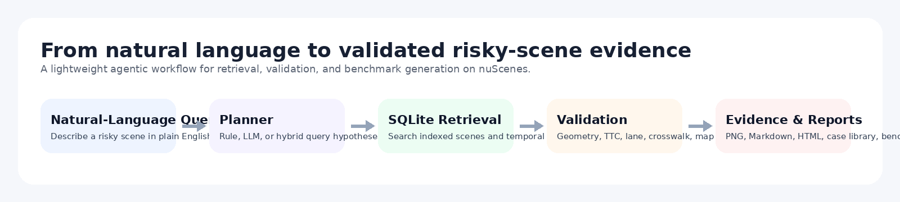
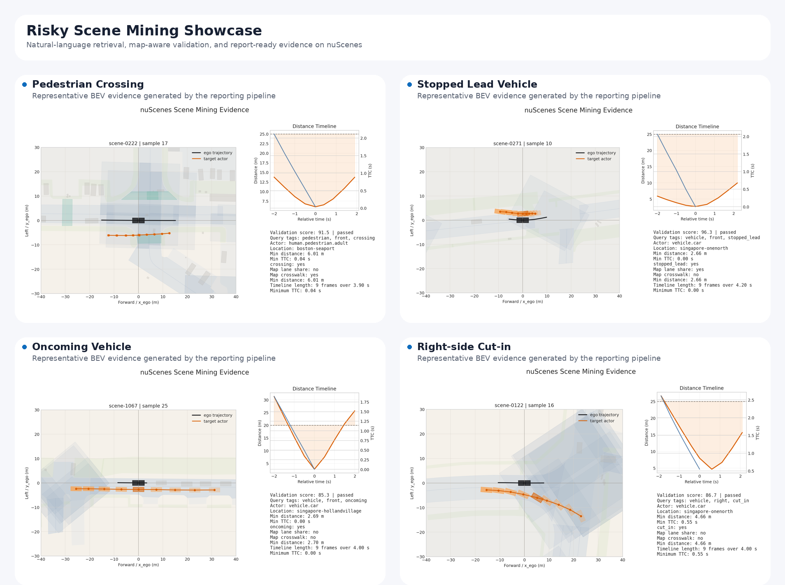
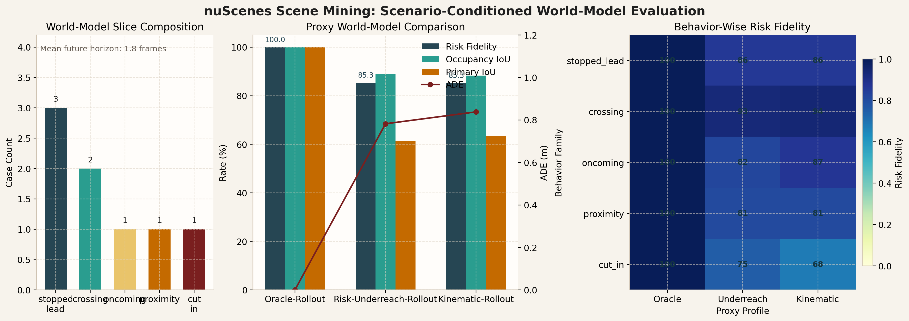

<div align="center">

# nuScenes Scene Mining Agent

Natural-language scene retrieval, validation, and benchmark generation on `nuScenes`.

`Python 3.10+` `Conda` `nuScenes` `Responses API` `Scene Mining` `Benchmarking`

</div>

<p align="center">
  
</p>

`nuScenes Scene Mining Agent` is a research-oriented toolkit for mining risky scenes from `nuScenes` and converting them into validated case libraries and benchmark artifacts.

It is not a driving policy, a simulator-first workflow, or an end-to-end training stack. The repository focuses on the data and evaluation side of autonomous-driving research:

1. interpret a natural-language risk query
2. retrieve candidate scenes from a `SQLite` index
3. validate them with geometry, motion, TTC, and map context
4. export evidence figures, reports, and case libraries
5. derive benchmark layers for scenario mining, perception, and world-model evaluation

## Overview

- `rule`, `llm`, and `hybrid` query modes for natural-language scene retrieval
- deterministic validators for actor grounding, event localization, TTC, lane relation, and crosswalk context
- reference-aware scenario-mining benchmarks derived from validated cases
- scenario-conditioned perception slices for evaluating external tracking or detection outputs
- scenario-conditioned world-model slices for evaluating future rollouts and multi-modal forecasts
- adapters for official `nuScenes` prediction JSON and external trajectory-forecast outputs

<p align="center">
  
</p>

## Main Components

### 1. Scene Retrieval and Validation

The repository turns free-form risk descriptions such as pedestrian crossing, same-lane stopped lead vehicle, oncoming conflict, or lateral cut-in into structured retrieval hypotheses. Candidates are validated with explicit evidence instead of text similarity alone.

### 2. Scenario-Mining Benchmark

Validated cases can be converted into a reference-aware scenario-mining benchmark with scene, actor, and event-window supervision. This supports controlled comparison of `rule_only`, `llm_planner`, and `hybrid_agent`.

### 3. Scenario-Conditioned Perception Benchmark

Validated scenario anchors can be converted into short event-window actor tracks in ego coordinates. This layer evaluates external BEV tracking or detection outputs on mined risk slices rather than on the full dataset distribution.

### 4. Scenario-Conditioned World-Model Benchmark

The repository also derives compact world-model slices with observed history, short future horizon, sparse future occupancy, and challenge-track labels. This layer supports proxy rollouts, official `nuScenes` physics baselines, and external multi-modal forecast methods.

### 5. External Multi-Modal Baseline Integration

The current repository includes a runnable integration for `ContextVAE` (IEEE RA-L 2023), evaluated on the forecast-compatible subset of the world-model benchmark.

## Representative Results

Local `v1.0-trainval` outputs currently cover four benchmark layers:

| Layer | Local snapshot |
| --- | --- |
| Scenario mining | `16` trainval queries; all three retrieval profiles reach `16/16` `Pass@1`, while reference-aware metrics separate `rule_only`, `llm_planner`, and `hybrid_agent` |
| Perception slices | `8` mined risk slices; official `nuScenes` tracking or detection JSON can be aligned and evaluated on covered subsets |
| World-model benchmark | `8` scenario-conditioned slices with challenge tracks, replay export, and baseline comparison |
| `ContextVAE` baseline | `7` forecast-compatible slices; `7/7` full horizon, `ADE 0.280`, `MinADE@5 0.207`, `Risk Fidelity 0.841` |

On the same `7`-case forecast-compatible subset, the local physics baselines score:

| Profile | ADE | MinADE@5 | Occupancy IoU | Risk Fidelity |
| --- | --- | --- | --- | --- |
| `physics_oracle` | `0.135` | `0.135` | `0.197` | `0.860` |
| `cv_heading` | `0.139` | `0.139` | `0.197` | `0.859` |
| `contextvae` | `0.280` | `0.207` | `0.181` | `0.841` |

Detailed tables and benchmark notes are in [docs/benchmark_snapshot.md](docs/benchmark_snapshot.md).

<p align="center">
  
</p>

## Quickstart

### 1. Create the environment

```bash
conda env create -f environment.yml
conda activate nuscenes
```

If the environment already exists:

```bash
conda env update -f environment.yml --prune
conda activate nuscenes
```

### 2. Download the data

Dataset links and expected archive names are listed in [docs/dataset_downloads.md](docs/dataset_downloads.md).

Check archive readiness:

```bash
python -m nusc_scene_agent inspect-archives --workspace .
```

### 3. Prepare `v1.0-mini` and run one query

```bash
python -m nusc_scene_agent prepare-data --workspace . --profile mini

python -m nusc_scene_agent build-index \
  --version v1.0-mini \
  --dataroot data/sets/nuscenes \
  --db artifacts/index/v1.0-mini.sqlite

python -m nusc_scene_agent query \
  "pedestrian crossing at close range ahead of ego lane" \
  --db artifacts/index/v1.0-mini.sqlite \
  --output outputs/mini_query \
  --query-mode rule
```

### 4. Build the trainval index and run the benchmark

```bash
python -m nusc_scene_agent prepare-data --workspace . --profile trainval-full

python -m nusc_scene_agent build-index \
  --version v1.0-trainval \
  --dataroot data/sets/nuscenes \
  --db artifacts/index/v1.0-trainval.sqlite

python -m nusc_scene_agent benchmark \
  --config benchmarks/trainval_suite_v1.yaml \
  --db artifacts/index/v1.0-trainval.sqlite \
  --output outputs/trainval_suite_llm_hybrid_en_v1 \
  --query-mode hybrid \
  --rerank-mode llm
```

### 5. Run the `ContextVAE` world-model baseline

Install the optional forecast dependencies:

```bash
pip install -e ".[forecast]"
```

Clone the external repository:

```bash
git clone https://github.com/xupei0610/ContextVAE.git external/ContextVAE
```

Run the benchmark integration:

```bash
python -m nusc_scene_agent run-contextvae-world-model-study \
  --benchmark benchmarks/trainval_world_model_slices_v1.json \
  --dataroot data/sets/nuscenes \
  --version v1.0-trainval \
  --output outputs/contextvae_world_model_study_v1 \
  --repo external/ContextVAE \
  --checkpoint external/ContextVAE/models/nuscenes_res18 \
  --device cuda \
  --batch-size 4 \
  --mode-count 5 \
  --clustering-samples 2000
```

If the checkpoint is missing, the integration downloads the public `nuscenes_res18` release automatically.

## Data Policy

This repository does not include:

- `nuScenes` archives
- extracted dataset files
- map files
- local `SQLite` indices
- generated benchmark outputs
- external baseline repositories

Large local directories such as `archives/`, `data/`, `artifacts/`, `outputs/`, and `external/` are excluded from version control through [.gitignore](.gitignore).

## Optional LLM and LangGraph Support

`LLM` support is optional. Rule-only retrieval does not require API configuration.

To enable `--query-mode llm|hybrid` or `--rerank-mode llm`, set:

```bash
export NUSC_SCENE_AGENT_LLM_BASE_URL="https://your-openai-compatible-endpoint"
export NUSC_SCENE_AGENT_LLM_API_KEY="your-key"
export NUSC_SCENE_AGENT_LLM_MODEL="your-model"
```

The runtime uses an OpenAI-compatible `Responses API` flow.

Optional `LangGraph` orchestration support:

```bash
pip install -e ".[agent]"
```

## Repository Layout

```text
src/nusc_scene_agent/    core library and CLI
benchmarks/              benchmark configs and exported benchmark JSON
assets/                  static figures referenced by the README and docs
docs/                    architecture, benchmark notes, and dataset links
tests/                   unit tests for retrieval, validation, reporting, and benchmarks
environment.yml          conda-first environment
```

Use `python -m nusc_scene_agent --help` to inspect the full command surface.

## Documentation

- [Architecture Notes](docs/architecture.md)
- [Benchmark Snapshot Notes](docs/benchmark_snapshot.md)
- [Dataset Downloads](docs/dataset_downloads.md)

## License

Released under the [MIT License](LICENSE).
